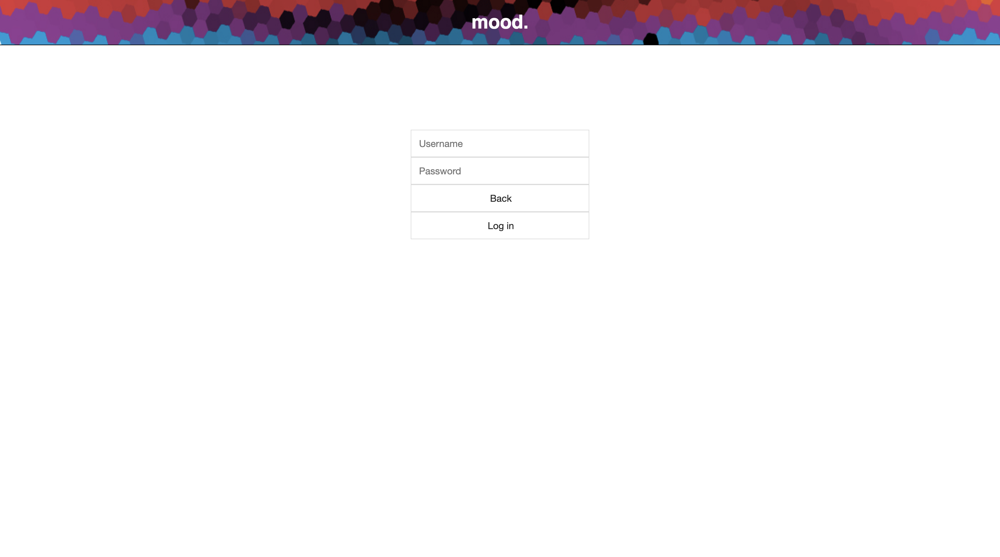
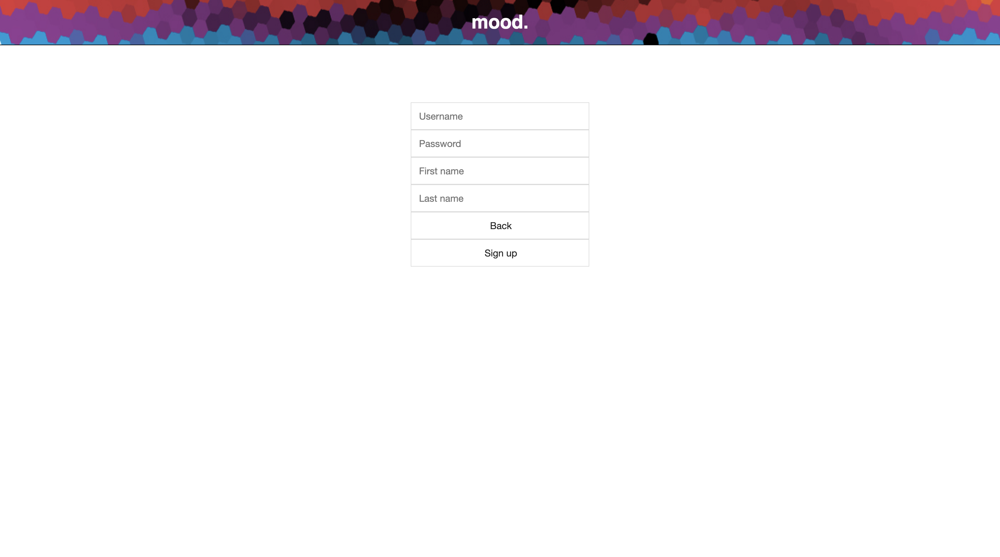
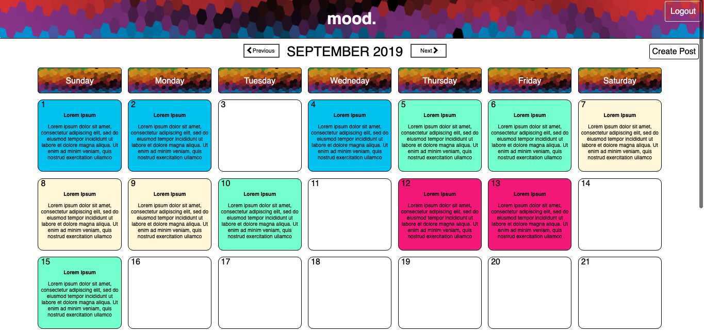
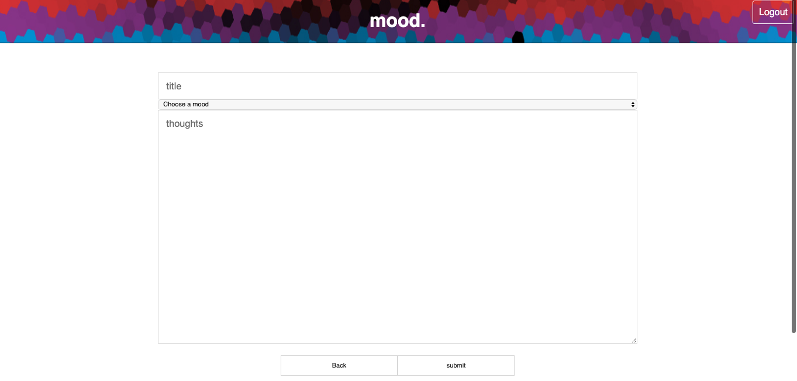
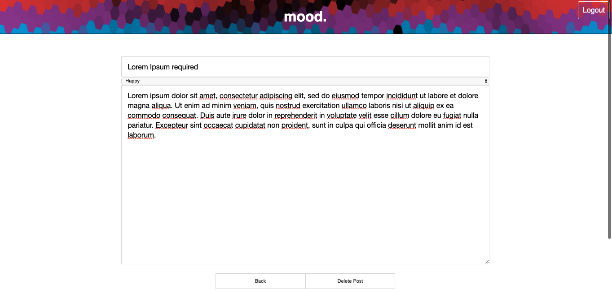

# Mood Project

## Demo

- [Live Demo](https://infinite-island-27570.herokuapp.com/)

The goal of this project is the ability to see which EDM artist is playing in a particular area
and be able to listen to its top songs.

## Motivation

Most sites have it where they are able to show where EDM artists playing but doesn't have a way to listen 
to the artist's music at the site. I've made it where its possible to listen to it without having to search. 
After a few clicks, it will direct you to the song on Youtube's page.

## Screenshots

Start Page:

Login Screen:

Register Screen:

Dashboard Screen:

Edit Page:

Update Page:

## Built With

### Front-End
* HTML
* CSS
* JAVASCRIPT
* JQUERY
* AJAX
* RESPONSIVE DESIGN CSS

### Back-End
* Node.JS
* MongoDB
* Mongoose
* Passport-JWT
* Passport-Local

## Authors

* **Christopher Vo
