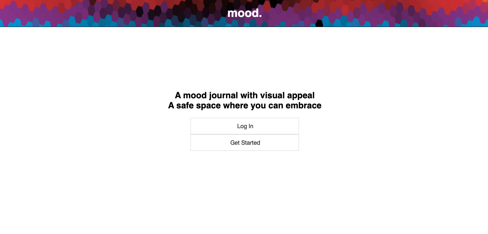

# Mood Project

## Demo

    username: localuser
    password: localpassword

- [Live Demo](https://infinite-island-27570.herokuapp.com/)

An online mood journal that is displayed on a calendar.

## Motivation

When I was exiting out of depression, I wrote a lot when I was feeling down or happy. These important events allowed me to be more self-aware of why I was feeling specific emotions and allowed myself to correct my own actions or steer away from certain things. By having a mood journal to write and store in, I'm able to see and track my moods throughout the months and be more self-aware.

## Future Feature Implementations

Mood Tracker - Calculates how many times you have felt for each emotion per month
Mood Common Demoninator - Figures out the most common words said per emotion to find any common themes

## Screenshots

Start Page:

Login Screen: for demo purposes use 
username: localuser | password: localpassword

Register Screen:

Dashboard Screen: On this screen, you'll be able to create a post for the current day only. You'll be able to click on any journal posts and edit.

Update Page:

Edit Page:

## Built With

### Front-End
* HTML
* CSS
* JAVASCRIPT
* JQUERY
* AJAX
* RESPONSIVE DESIGN CSS

### Back-End
* Node.JS
* MongoDB
* Mongoose
* Passport-JWT
* Passport-Local

## Authors

* **Christopher Vo
